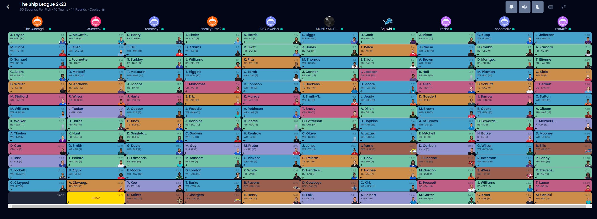

# Draft Rankings 2022

## AirBudweiser - A-

After an 11 hour drive and almost getting murdered in the Best Buy parking lot, Tom pulled out a surprising draft. Picking two of the young core running backs followed by 2 WR 1s is leaving tom with a chance to win the whole thing. The question here is who the hell is Dameon Pierce and what is going on down there in Texas. If the new Call of Duty is good there is a chance Kyler Murray completely quits football and joins FaZe Clan.

## Zaddy Burrow - B

Although Cooper Kupp might be a little overrated this year, Mollys early picks are something to be happy with. Pittman in the fourth is a very solid pick up for a good WR core. Im not sure how Brandin Cooks is still able to walk after all of his concussions over the years. If Chicago can somehow sneak out a few wins you damn well know Montgomery is going to be the reason why. Not much to say negatively about this draft, but nothing points to this being an out of the park draft.

## 3ScreenZ - C+

After 2 seasons of rostering Derrick Henry and 0 wins Michael decided to switch things up to possibly the 2 most fragile RBs in fantasy football. It is no surprise Russell Wilson is on his roster for the 3rd consecutive year. Expecting Geno Smith to throw touchdowns to DK and be a WR2 is going to be a rude awakening. A kicker in the fifth makes me give this draft no higher than a C, and expect Michael to be runningbackless in a few weeks.

## Reziot - C

Looking at the draft board and seeing 2 Cincinnati Bengals players picked in the first 2 rounds made me think I was looking at Gideon's draft board. A Superbowl run last year is one thing, but expecting the only team without an indoor training facility to have a good season is a tough bet. Jacob was able to turn the draft around late with Amon Ra and Elijah Mitchell which has potential to be a top 10 RB. Overall an average draft, but being stuck watching Cincinnati games the rest of the season is probably the worst part.

## Dee Snuts - A

Simon quietly snuck away with one of the better drafts that I have seen in fantasy. The first overall pick of JT was an easy one, but 2 top 10 WRs followed by a top 5 TE and great second RB. Picking up Kenneth Walker in the 8th was a steal especially with so many Spartans drafting. The only questionable thing in this draft moving my score from an A+ to an A was taking 2 QBs when there are only 10 teams. Overall Simon should have a fun time winning games.

## Diggs In A Blanket - D-

Where do we start with this one. Lets start with the questionable first round pick of Diggs. I know he is needed to complete the fantasy football name, but it would have been possible to pick him up in the second and change your name slyly afterwords. Tom Brady and Julio Jones might be the oldest QB/WR combo that has ever played football. Juju Smith is going to be making Tik Toks every Sunday with Jackson Mahomes. Overall a very questionable draft outside of Aaron Jones, Michael Thomas, and TJ Hockenson. Where was Molly to give Connor some assistance?

## tedstacy2 - B+

With Michael passing on Derrick Henry it was a no-brainer to pick him third. Tyreek is questionable with Tua at QB or he would have been a first round pick, not saying its a bad thing just a risk. Scary Terry & Josh Jacobs is where Ted really ramped this draft up. Amari Cooper will be in a great spot once the serial predator comes back in week 8 (if he can still throw a football) just in time for the playoffs. Overall Ted should see some success early in the season if Henry can stay healthy.

## rsat4life - B

Its surprising to see just one Cincinnati player on Gideon's team this year, but it makes sense that its the kicker. The first four picks are high risk, high reward picks, including Kamara and Etienne. Jefferson should have a fine year with Cousins at the helm and a new offensive minded coach. The negative of Gid's team includes the heavy lack of WRs with only 3, and Gibson who has been taking snaps with the 3rd team offensive. Overall not a terrible draft.

## sneakyturtle2 - A-

For Mel's first fantasy football draft it is surprising to see such a well rounded team, which we can mark up to my coaching in our mock drafts. Ekeler is a solid first rounded followed by Devante in the second at 17th overall which is an absolute steal. Drake London has potential to be a top 20 receiver this year if Mariota can play how he played in the one game in Vegas last year. The biggest question mark here is why Mahomes was picked before Allen. Overall I can see this team having a solid shot at the playoffs if healthy.